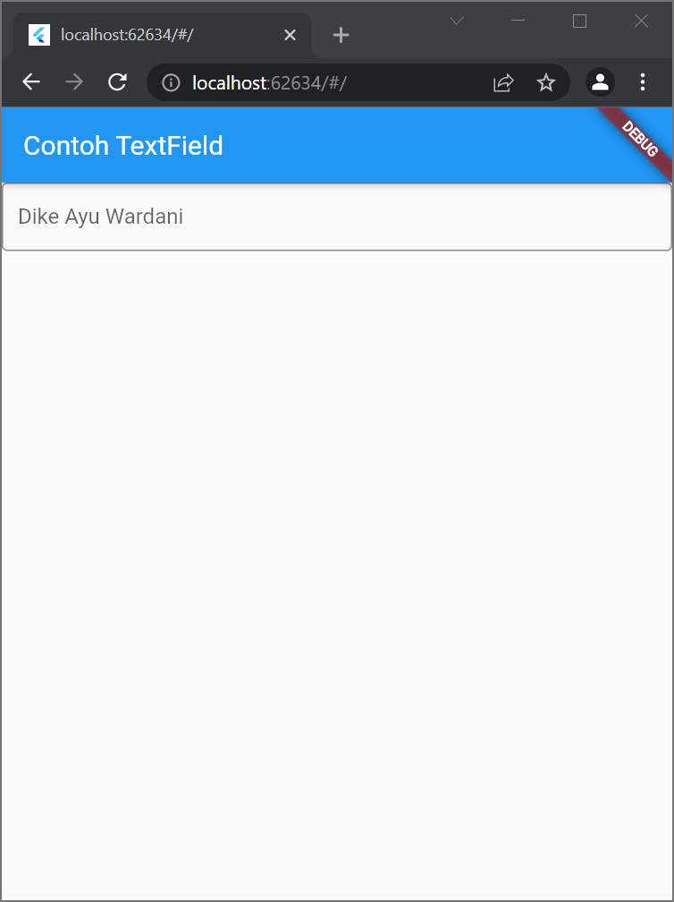

# flutter_basic

Nama: Dike Ayu Wardani
NIM: 2031710147
Kelas: MI-2C
Prodi: D3-MI

## Widget
1. Text

2. Image

3. Cupertino

4. Button

5. Scaffold

6. Dialog

7. Input dan Selection

8. Date and Time Pickers

## Layout
1. Property Child

2. Property Alignment

3. Property Color

4. Property Height dan Width 

5. Property Margin

6. Property Padding

7. Property Transform

8. Property Decoration

9. Column Widget

10. Row Widget

11. Stack

12. ListView

13. GridView

## Praktikum 1 Membuat UI Sederhana

